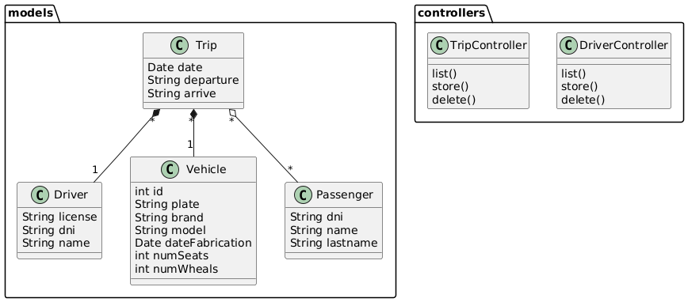
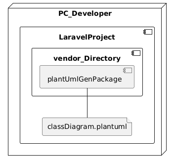

<h1 style="text-align:center;">MEMORIA DESCRIPTIVA   PlantUMLGen</h1>

## CAMPO DE APLICACIÓN

Esta aplicación es una librería para proyectos Laravel que intentan mantener vivo los diagramas de diseño de software con el código fuente. Esta aplicación esta pensada para estudiantes de la carrera de ingenieria en Informática y afines, en el que estos estudiantes puedan hacer diagramas como el diagrama de clases para que esta libreria genere codigo fuente a partir de estos modelos.

## ANTECEDENTES DEL SOFTWARE

Muchos estudiantes de pregrado perciben que al realizar el diseño de un software mediante diagramas como el de despliegue, componentes, clases, logica y otros; terminan desechandolos ya que al codificar el software los diagramas realizados solo les sirvieron de base inicial y en el camino, el software sufre cambios que no son actualizados en estos diagramas. Estos se consideran documentos muertos

Esta libreria promueve el uso de los diagramas, manteniéndolos vivos durante el proceso de desarrollo de software, ya que cualquier actualización de arquitectura, debe hacerse en los diagramas y estos se deben sincronizar con el codigo fuente de la aplicacion en desarrollo. Así, el diagrama y el codigo fuente siempre coincideran.

Esta libreria es de gran utilidad sobretodo en los procesos de formación de estudionates en diseño y arquitectura de software.

## OBJETIVOS DEL SOFTWARE

Generar codigo fuente Laravel de arquitectura a partir del diagrama de clases de la aplicación.

## FUNCIONALIDAD DEL SOFTWARE

* Generación de Modelos.- A partir del diagrama de clases la librería puede generar las clases Models de aplicación. Estas clases son creadas mediante arcihvos en los directorios correspondientes de Laravel.

* Generacion de migraciones.-  A partir del diagrama de clases la librería tiene la capacidad de generar las mmigraciones que seran desplegadas a la base de datos de la aplicación. Estos archivos son creadas mediante arcihvos en los directorios correspondientes de Laravel.

* Generacion de controladores.- A partir del diagrama de clases, la librería también puede generar las clases Controllers de la aplicación. Estas clases son creadas mediante arcihvos en los directorios correspondientes de Laravel.

## ESTRUCTURA DEL SOFTWARE

El sistema utiliza tecnologia de software libre escrito en PHP8 para el framework Laravel6. No almacena datos de forma persistente, por lo que no se conecta a una base de datos, ya que es una libraria que abstrae lógica para ayudar a los desarrolladores novatos. Los requirimientos minimos para el funcionamiento del servidor con el sistema son::

* Computador con mínimo 4GB de RAM.
* Espacio destinado en disco duro promedio de 200MB.
* Corre en sistemas operativos Linux Ubuntu, CentOS, RedHat siempre que cuente con un navegador web.

EL software esta pensado en las PCs de los desarrolladores de software. Una vez instalado no se requiere el uso de internet. El almacenamiento de los datos no se basa en una base de datos sino en un archivo plano en formato UML. este archivo contiene una manera estructurada de presentar los datos al que se puede considerar como el modelo de datos ejemplo:

La aplicación se embebe dentro del proyecto Laravel del desarrollador. Por tanto, tiene un despliegue que se basa en el siguiente diagrama:

Para desarrollo, solo debe ejecutar el comando "composer install" e iniciar con el desarrollo. 

Para enviar la libreria a producción, debe enviar de manera versionada (1.0.1) hacia la plataforma https://packagist.org, asi estará disponible para cualquier desarrollador que quiera usar la libreria.
