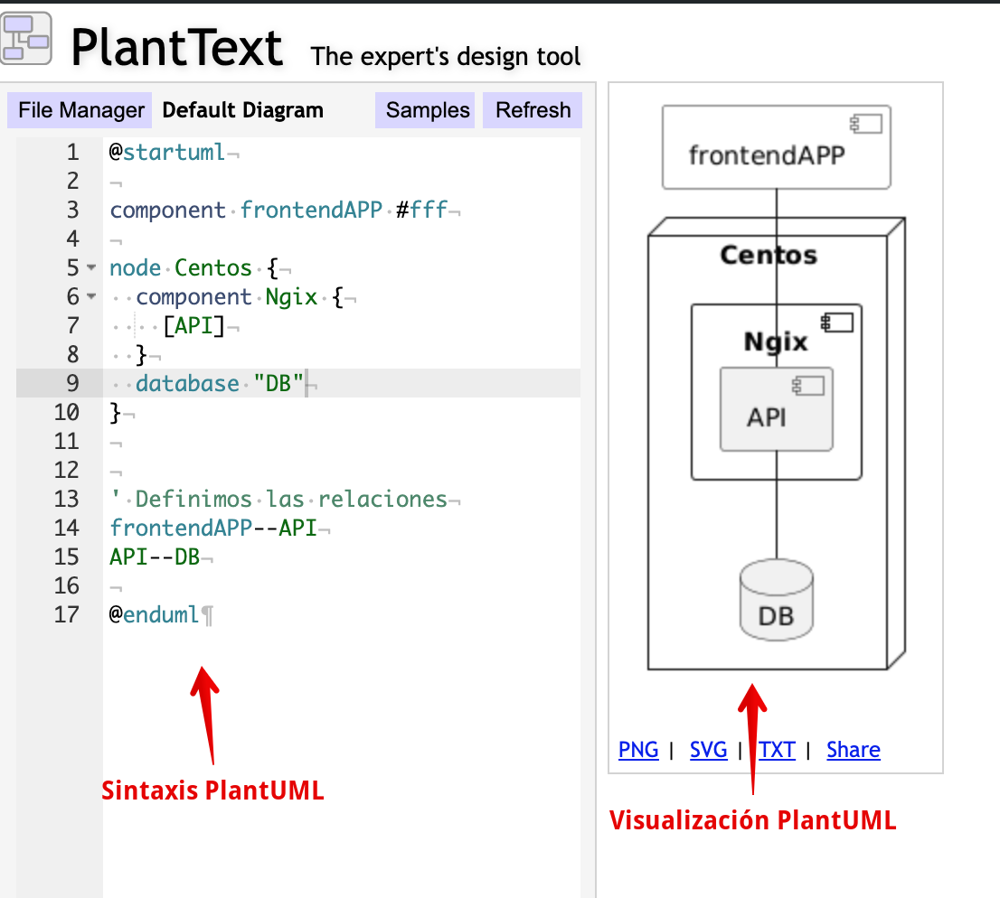
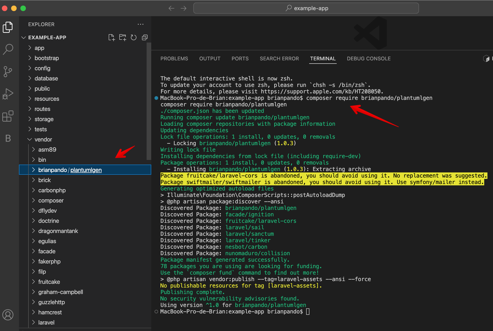
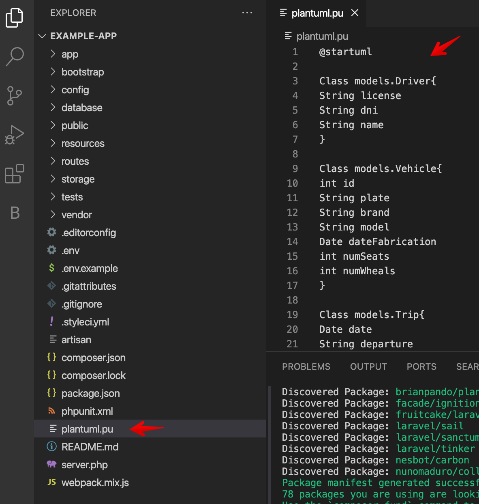
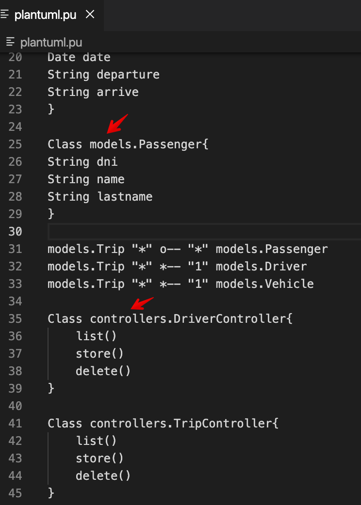
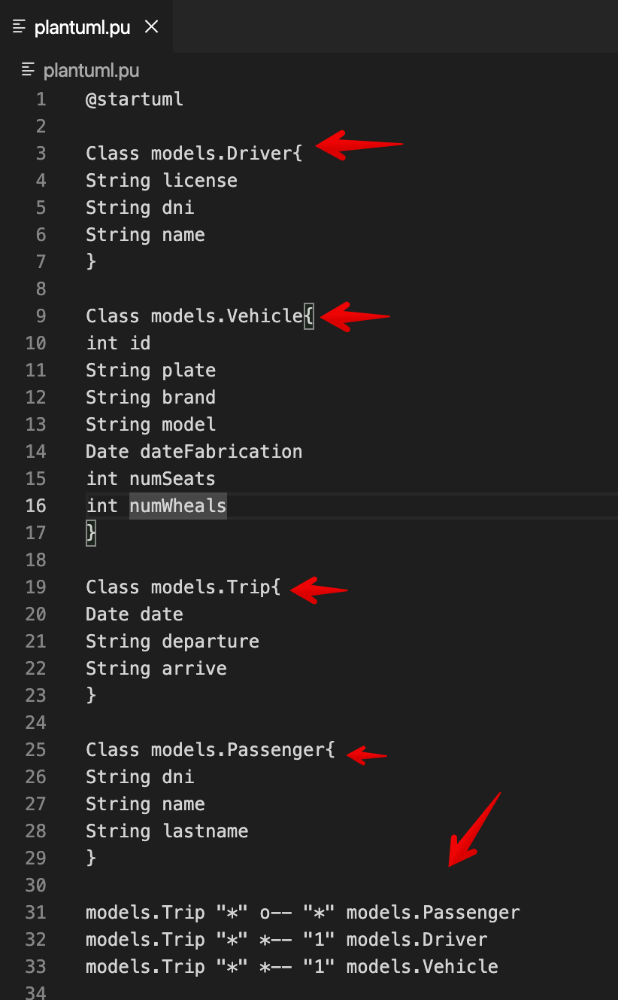
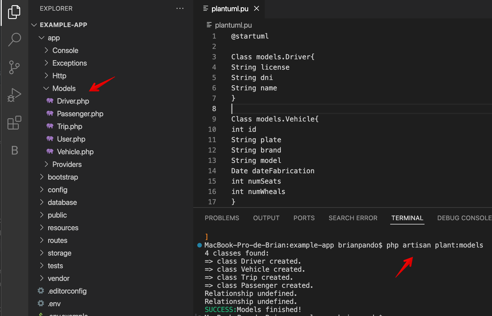
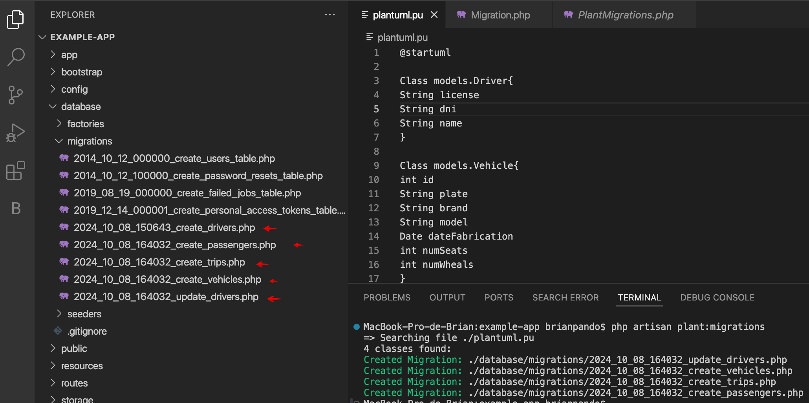
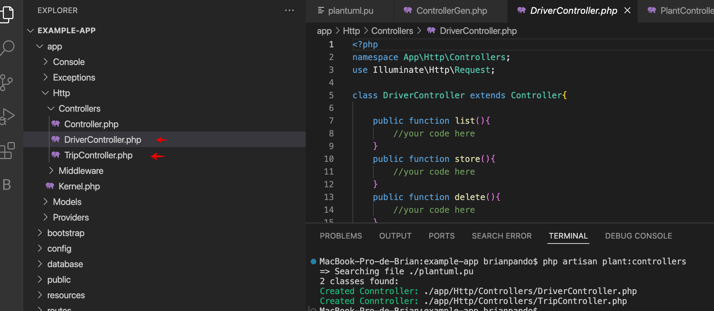

<h1 style="text-align:center">PlantUMLGen<br /> [Manual de Usuario]</h1>
<p> Version:1.0 | 07/10/24 | Brian Pando </p>

## Que es PlantUML?
<p style="text-align:justify">
<a href="https://plantuml.com">PlantUML</a> es una herramienta de diagramación que permite crear diagramas basado en UML. A diferencia de otras herramientas, PlantUML se crea escribiendo texto, por lo que se vuelve reproducible y rapidamente modificable.</p>

<p style="text-align:center;">

</p>

<p style="text-align:justify">Existen varios editores para escribir la sintaxis PLantUML. En este ejemplo se usa el editor en linea llamado <a href="https://www.planttext.com/">PlantText</a>.


## La libreria
 Esta libreria o coonocido tambien  como paquete Laravel, se basa en el  <a href="https://plantuml.com/es/class-diagram">diagrama de clases UML </a> para crear las clases de un proyecto bajo el patrón de arquitectura Modelo Vista Controlador (MVC) en Laravel. Para elaborar un diagrama de primero tener un poco de teoría sobre este tipo de diagramas.

## Instalar la libreria.                              
<p style="text-align:justify">La libreria esta disponible para ser usada dentro de un proyecto Laravel, el gestor de paquetes para un proyecto de este tipo es  Composer, por tanto, para instalar esta libreria debe ejecutar dentro del directorio de su proyecto: </p>

```bash
composer require brianpando/plantumlgen
```

<p>Si todo salio correctamente, en el directorio /vendor de Laravel se abrá agregado el nuevo paquete "brianpando/plantumlgen"</p>
<p style="text-align:center;">

</p>

## Crear el arcihivo PlantUML.
<p style="text-align:justify">Para empezar a usar la libreria, en la ruta raiz de su proyecto Laravel debe crear el archivo ./plantuml.pu. En este archivo debe estar codigo plantUML del diagrama de clase.</p>

<p style="text-align:center;">

</p>

<p style="text-align:justify"> Basandose en el patrón MVC, debe considerar los namespaces Models y Controllers para que la libreria pueda interpretar los que intentas crear.</p>
<p style="text-align:center;">

</p>

## Crear las clases Models.
<p style="text-align:justify">La libreria buscará en el archivo plantuml.pu, todas las clases que pertencen a la capa Model. También, ubicara las relaciones entre estos Models.</p>
<p style="text-align:center;">

</p>

<p style="text-align:justify">Para poder crear estos Models en el proyecto, debe ejecutar el siguiente comando:</p>

```bash
php artisan plant:models
```
<p style="text-align:justify">Resultado de ese comando, se muestra un mensaje de modelos creados. Puede verificar que se han creado archivos en el directorio Models/</p>
<p style="text-align:center;">

</p>

## Crear los archivos Migrations.
<p style="text-align:justify">Laravel conectado a una base de datos relacional como Mysql, PostgreSQL y otros, se basa en archivos de migraciones, estos archivos permiten tener organzada la estructura de la base de datos desde el codigo laravel. Por tanto, esta libreria permite crear los archivos Migrations a partir del diagrama de clase. Para crear estos archivos debe ejectuar el comando:</p>

```bash
php artisan plant:migrations
```
<p>Resultado de la ejecución se crean los archivos de migraciones con los campos y relaciones tomadas del diagrama de clase.</p>

<p style="text-align:center;">

</p>


## Crear las clases Controllers
<p style="text-align:justify;">Finalmente, hemos llegado a la parte superior de la arquitectura. Para crear los controladores debe ejecuutar el siguiente comando:</p>

```bash
php artisan plant:controllers
```
<p style="text-align:justify;">Al ejecutar este comando, se habran creados las clases controladores dentro del directorio ./app/http/controllers/ siguiendo el patron de Laravel.</p>

<p style="text-align:justify;">

</p>

<p style="text-align:justify;">Ahora podria codificar dentro de las clases controladores y models sin problemas, si luego debe agregar alguna propiedad a las clases modelos o quiere crear mas modelos, debe hacerlo en el diagrama y luego volver a correr el comando para Models.</p>

<p style="text-align:justify;">Si quiere crear mas controladores, hagalo en el diagrama y vuelva a correr los comandos del controlador. En ambas capas, puede escribir codigo y no se perderan cuando vuelva a correr estos comandos.</p>


<p>FIN.-</p>